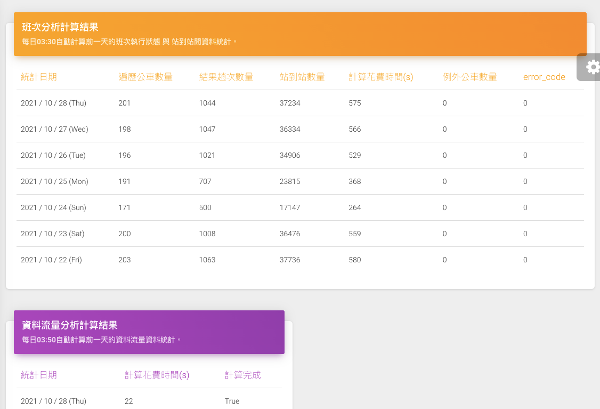
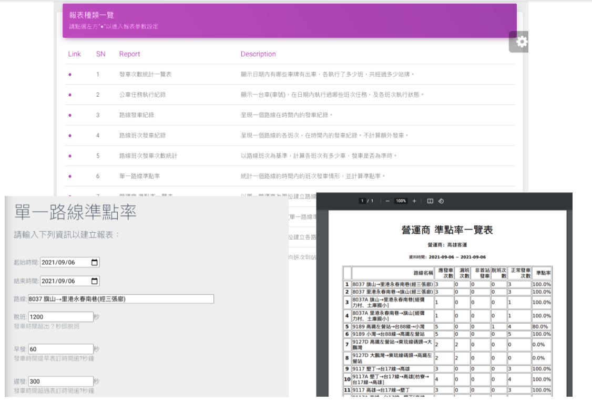
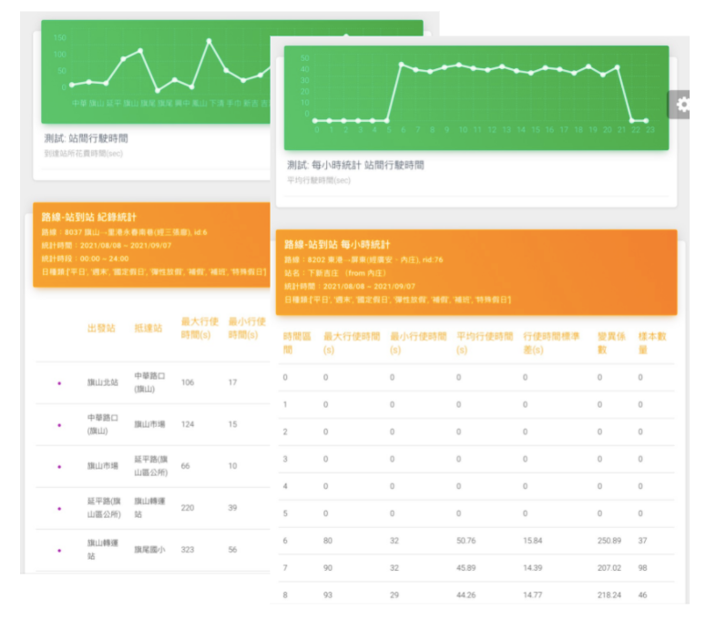
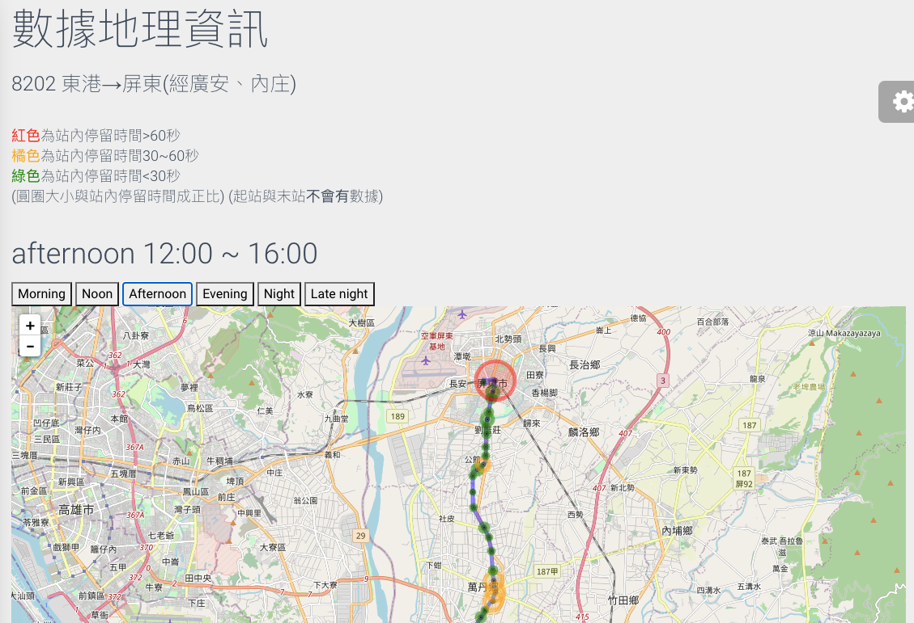
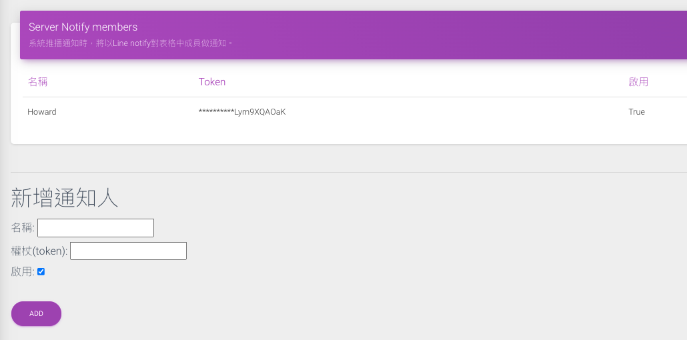
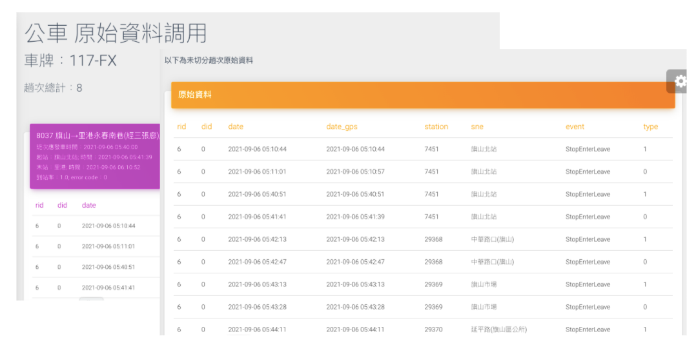
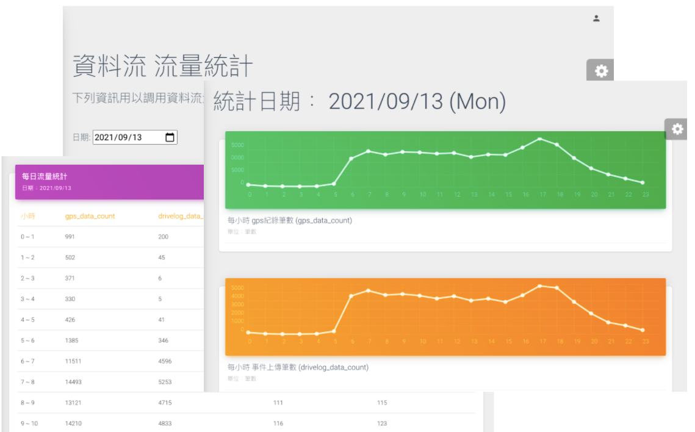
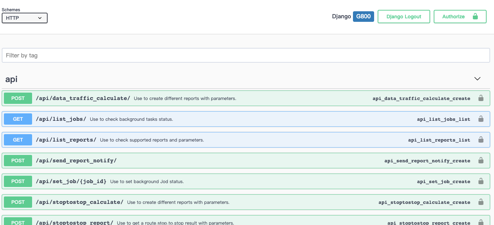
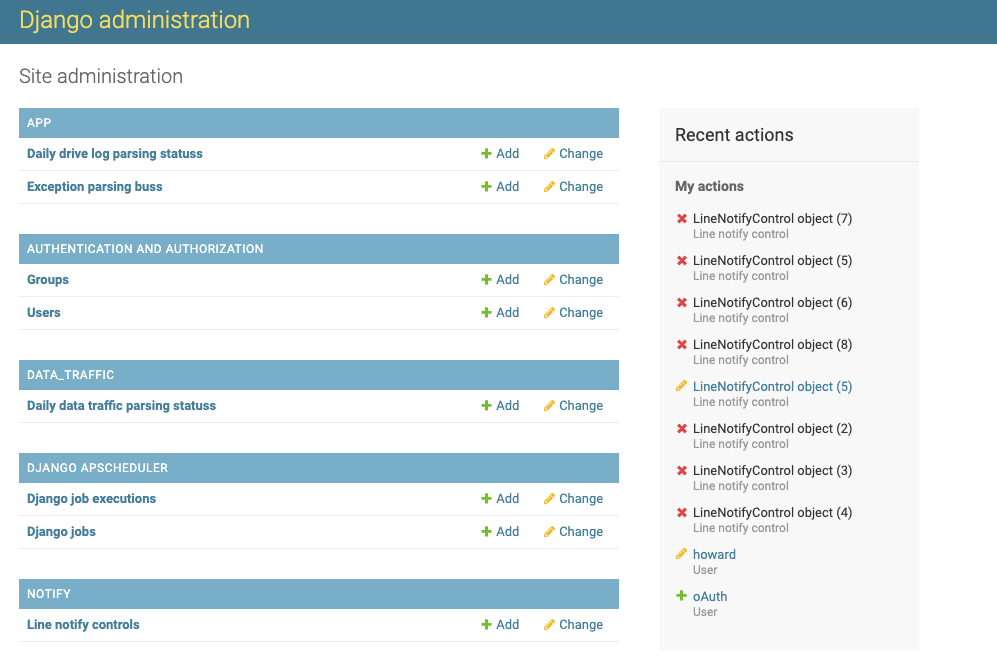
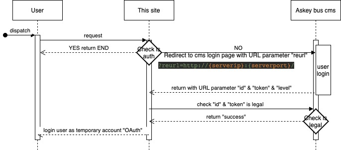

# 公車資訊系統
## Introduction：
本系統為網頁網站，主要功能訴求在於：
1. 分析統整公車行駛數據，建立分析後資料。
2. 生產各項報表，利於使用者管理公車行駛行為等。
3. 以多種方式呈現視覺話數據，利於使用者觀察、比較各項統計結果。

## Environment：
**python3.8** with **Django2.2.24** <br>
work with **mySQL** & **MongoDB**

## Description：
基於作為縣市公車管理的輔助系統，本系統設計最初的主旨在於產生各項不同的報表，方便業者能夠基於公車的行駛紀錄自動產生相對應的電子化報表。
能夠有效地減少人工的時間與複雜度。
<br>
在此基礎之上，本系統亦陸續增加不同的數據分析的比較頁面、自動化運算結果的通知、資訊地理視覺畫的功能等，作為技術展示。

## Index:
1. [Features](#Features:)
2. [Installation](#nstallation:)
3. [Database Schema](#Database Schema:)

## Features
### 1. 每日自動運算：
* 本站首頁呈現每日自動計算的結果。
* 在每天固定的時間(03:30)，程式將自動演算，遍歷前一天所有的公車紀錄，作為資料的前處理。
* 首頁呈現的資訊即是每日計算的結果。若有異常將會以紅色顯示


### 2. 報表：
* 可以條列式呈現各報表的名稱及功能，並且在選擇後羅列出產生報表所需的參數，供使勇者做選擇。
* 本站報表以python開發，設計特色在於能夠快速繼承基本樣板。除了既有的報表種類，亦能根據需求快速生成不同的報表。
* 除了以網頁瀏覽，報表也支援轉存pdf。


### 3. 站到站統計：
* 用以統計一個路線中，個站之間的行駛時間與等待時間時間的統計結果。
* 統計的方式能夠選擇平日、假日等日種類的選項，也能夠單獨以表格呈現一個站在24小時的統計變化。
* 為了直覺地顯示，這邊也提供了視覺畫的圖表供使用者參考。


### 4. 資料表比較：
* 此功能用來比較在不同條件下產生的報表數據差異性。
* 在此可以玄則比較的報表種類，填入相關參數後，系統將報表以左右對應的方式產生在畫面上。


### ５. 數據地理資訊(地圖)：
* 導入真實地圖，將公車的行駛統計數據，以圖像的方時直覺呈現在地圖上。
* 導入時間段，可以動畫的方式觀看不同時間段在地圖上的數據變化。


### 6. 通知推播名單：
* 可以用來管理接收推播者的名單
* 整合LINE Notify，系統將自動推送每日計算結果到名單上的人。
* 使用者需要自行申請LINE Notify token，並依照LINE官方說明使用。


### 6. 原始資料調用：
* 在做統計時，有時議會需要調閱原始資料。此頁面能夠調用公車車機回傳的原始資料，以及系統在做資料前處理後的結果。


### 7.資料流量統計：
* 用圖表的方式呈現一天內，每個小時的資訊流量、事件回報量、公車在線處量、公車在路上的數量。


### 8. Swagger (API)：
* 作為網站的應用，本站亦提供許多彈性的api，作為整合的應用。
* 本站以Swagger UI來提供標準的說明與測試頁面，方便開發人員以清楚直覺的方式了解多項複雜的API應用格式。


### 9. Administration：
* 系統管理者頁面，此頁面提供了系統背景工作的詳細現狀與紀錄，以及其他各項資料庫操作選項，使資訊管理者能夠直接對原始資料做修改。
* 包括使用者的新增刪除、通知推播的新增刪除等；每日自動工作亦可在此調整。


### Extra: 
* 本系統在使用者認證上有以OAuth串接Askey計有認證系統。
* 與一般Oauth部分相異，請參考下圖：
* **記得在user中新增使用者"oAuth"**


## Installation
### what you will need:
欲建立此系統，需注意幾件事情：
1. 此系統需配合
     1. Askey 既有公車系統的mysql & mongoDB 
     2. 使Django framework自由調用的mysql 
     3. 建立專門給此專案的.env file 內所需參數
2. .env file 內所需參數: 
``` python
PROJECT_TITLE = <專案名稱>  # 可自由取名，名稱講呈現在網頁的sidebar上

DEBUG=False 
DJANGO_LOG_LEVEL = DEBUG 
SECRET_KEY= <Django secret key> 
# Django 相關參數，不贅述。

SERVER = xxx.xxx.xxx.xxx  # 請使用部署到的web ip(不可使用"*"，因為會使認證轉跳失敗)
SERVER_PORT = x  # 部署到的web port

TEMP_USER = oAuth
TEMP_PW = AskeyoAuth
# 作為oAuth預設登入的帳號密碼

EBUS_MONGODB = {"host":"xxx.xxx.xxx.xxx","port":x,"user":"<username>","password":"<password>"} 
# 填入雅敘用以記錄車輛drivelog的mongoDB相關資訊

EBUS_SQLDB = {"host":"xxx.xxx.xxx.xxx","port":x,"user":"<username>","password":"<password>"} 
# 填入雅敘用以記錄中心資訊的mysql相關資訊

SITESQL_SCHEMA = <DB name>
SITESQL_HOST = xxx.xxx.xxx.xxx
SITESQL_PORT = x 
SITESQL_USER = <username> 
SITESQL_PW = <password>
# 作為Django framework調用的mysql相關資訊

TIME_SHIFT = 02  
# 日期分割的偏移量。預設以半夜12點作為日期的分割。但考慮到有行駛跨日的車輛，可設置時間偏移。
# 此例為02:00前發車的公車紀錄，屬於前一日的班次。

LINE_TOKEN = sy9uCRiHNBDVzCCvrDDKkUQtsroL4FD6YLym9XQAOaK 
# optional: 若新增此項，系統會補寄line notify每日計算結果給此token

TIME_ZONE = Asia/Taipei
# 時區，預設為"Asia/Taipei"
```

### Installation Steps:
#### Step 1:
     * 將原始碼clone至專案資料夾

#### Step 2:
     * 於專案資料集中新增.env
```$ touch .env```

#### Step 3:
     * 將Django與資料庫 migrate
     * 以下兩行指令，將會自動與上步驟設定的資料庫migrate。Django 將自動在database中建立運作所需的table。
```
$ python manage.py makemigrations
$ python manage.py migrate
```
#### Step 4:
* 建立super user
* 執行以下指令，跟著步驟建立superuser
```
$ python manage.py createsuperuser 
```

#### Step 5: 
* 確認dockerfile中expose port與目前使用中的port沒有衝突
* Django webserver 預設使用port 8000作為介面，若有疑慮請更改dockerfile中的 CMD

#### Step 6: 
* 執行docker build 以建立image
```
$ docker build --tag reportsite:mysite .
```
#### Step 7: 
* 執行docker run 啟動container
* 請確認環境docker所使用的port
```
$ docker run -p {port}:{port} --log-opt max-size=10m --log-opt max-file=5 --name reportsite reportsite:mysite
```

#### Step 8:
* Administration Page: http://{serverip}:{serverport}/admin/
* 以superuser帳號登入網頁Administration頁面，並新增user。
* 此user請按照.env中的 TEMP_USER & TEMP_PW 去建立。

----

## Database Schema
###### 簡介引用database種類＆欄位：

### 1. MongoDB:
###### 用以儲存車輛回傳行駛紀錄。<br>以下僅表述所使用到的欄位。
* Database name: 目前固定為 **ebus** ，hardcode在libary內。
* #### collectinos: 以日期命名之，如：drivelog_2021-10-31。
* document key value:
    * date: (Date)資料發送時間
    * date_gpe: (Date) 資料內gps資訊時間
    * lat: (Double)gps緯度
    * lon: (Double)gps經度
    * direct: (int32)gps方向
    * speed: (Double)gps速度
    * event: (String) 事件種類
        * StopEnterLeave: 進出站事件
        * LongStay: 原地停留超過5分鐘
    * type: (int32)事件參數
    * carno: (String)車牌號碼
    * rid: (int32)路線ID
    * vid: (int32)營運商ID
    * cid: (int32)車量ID
    * did: (int32)駕駛員ID
    * station: (int32)路線站ID(rsid)
    * sne: (String)中文站名
    * dutystatus: (int32) 值勤狀態
    * busstatus: (int32) 車輛狀態

### 2. mySQL:
###### 用以儲存中心的固定資料，如路線班次資訊等。<br>以下僅表述所使用到的欄位。
* Database (Schema) name:  目前固定為 **bus** ，hardcode在libary內。
* Tables:
    * **calendar**: 紀錄台灣內政部公布的上班放假等行事曆，無特別紀錄則視為平日。
        * date/name/isHoliday: 不贅述
        * holidayCategory、holidayCategoryType: 互相對應：
            * weekday: 0 -- 平日
            * weekend: 1 -- 週末
            * nationalHoliday: 2 -- 國定假日
            * bridgeHoliday: 3 -- 彈性放假
            * makeUpHoliday: 4 -- 補假
            * makeUpDay: 5 -- 補班
            * specificHoliday: 6 -- 特殊假日(勞動節)
            
            ```
            CREATE TABLE `calendar` (
            `id` int(11) NOT NULL AUTO_INCREMENT,
            `date` datetime DEFAULT NULL,
            `name` varchar(45) CHARACTER SET utf8mb4 DEFAULT NULL,
            `isHoliday` tinyint(4) DEFAULT NULL,
            `holidayCategory` varchar(45) DEFAULT NULL,
            `holidayCategoryType` int(11) DEFAULT NULL,
            PRIMARY KEY (`id`)
            ) ENGINE=InnoDB AUTO_INCREMENT=709 DEFAULT CHARSET=latin1
            ```
   
    * **car**: 車輛資訊。
        * id: cid，即為車輛id。
        * no: 車牌號碼。
        * vid: 所屬營運商id。
        
        ```
        CREATE TABLE `car` (
        `id` smallint(5) unsigned NOT NULL AUTO_INCREMENT,
        `gid` int(11) NOT NULL DEFAULT '1',
        `no` varchar(15) COLLATE utf8mb4_unicode_ci DEFAULT NULL,
        `alias` varchar(40) COLLATE utf8mb4_unicode_ci DEFAULT NULL,
        `imsi` varchar(40) COLLATE utf8mb4_unicode_ci DEFAULT '',
        `style` varchar(40) COLLATE utf8mb4_unicode_ci DEFAULT '',
        `updatetime` datetime DEFAULT NULL,
        `enable` tinyint(1) DEFAULT NULL,
        `seat` int(11) DEFAULT '0',
        PRIMARY KEY (`id`),
        UNIQUE KEY `imsi` (`imsi`)
        ) ENGINE=InnoDB AUTO_INCREMENT=23020 DEFAULT CHARSET=utf8mb4 COLLATE=utf8mb4_unicode_ci ```
        ```
        
    * **data_traffic**: 資料流量紀錄。
        * date/hour: 資料量時間，理論上應每小時都有一筆。<br>
            (ex: 2021-10-31 08:00 代表08:00~09:00)
        * gps_data_count: mongodb collection of gps數量
        * drielog_data_count: mongodb collection of drivelog數量
        * bus_on_rail_count: 時間內正在路上跑的公車數量。<br>
            (存在event:StopenterLeave)
        * bus_online_count: 時間內有上傳任何資訊的公車數量。
        
        ```
        CREATE TABLE `data_traffic` (
        `id` int(11) NOT NULL AUTO_INCREMENT,
        `date` datetime DEFAULT NULL,
        `hour` int(11) DEFAULT NULL,
        `gps_data_count` int(11) DEFAULT NULL,
        `drivelog_data_count` int(11) DEFAULT NULL,
        `bus_on_rail_count` int(11) DEFAULT NULL,
        `bus_online_count` int(11) DEFAULT NULL,
        PRIMARY KEY (`id`)
        ) ENGINE=InnoDB AUTO_INCREMENT=4033 DEFAULT CHARSET=latin1
        ```

    * **route**: 路線資訊。
        * id: rid，即為路線id。
        * vid: 營運商id。
        * name: 路線中文名稱。
        * gopoints: 可使用function解碼成一系列的經緯度list，用以在地圖上會出此路線行經路線。
        
        ```
        CREATE TABLE `route` (
        `id` int(11) NOT NULL AUTO_INCREMENT,
        `vid` int(11) NOT NULL,
        `name` varchar(128) COLLATE utf8mb4_unicode_ci DEFAULT '',
        `ename` varchar(128) COLLATE utf8mb4_unicode_ci DEFAULT '',
        `departure` varchar(128) COLLATE utf8mb4_unicode_ci DEFAULT '',
        `edeparture` varchar(128) COLLATE utf8mb4_unicode_ci DEFAULT '',
        `destination` varchar(128) COLLATE utf8mb4_unicode_ci DEFAULT '',
        `edestination` varchar(128) COLLATE utf8mb4_unicode_ci DEFAULT '',
        `gopoints` text COLLATE utf8mb4_unicode_ci,
        `backpoints` text COLLATE utf8mb4_unicode_ci,
        `goback` int(11) NOT NULL DEFAULT '0',
        `updatetime` datetime DEFAULT CURRENT_TIMESTAMP,
        `gxrid` varchar(10) COLLATE utf8mb4_unicode_ci DEFAULT NULL,
        `description` varchar(256) COLLATE utf8mb4_unicode_ci DEFAULT '',
        `edescription` varchar(256) COLLATE utf8mb4_unicode_ci DEFAULT '',
        UNIQUE KEY `theid` (`id`,`vid`)
        ) ENGINE=InnoDB AUTO_INCREMENT=367 DEFAULT CHARSET=utf8mb4 COLLATE=utf8mb4_unicode_ci
        ```
        
    * **routestop**: 路線經過站點資訊。
        * id: rsid，即為路線站id。(與sid不同意義。)
        * rid: 此站所述路線id
        * sid: 此站對應站id
        * clat/clon: 此站經緯度
        * valid: 此站是否使用中
        * seqno: 用來排序路線站續，以1為第一站。
        
        ```
        CREATE TABLE `routestop` (
        `id` int(11) NOT NULL AUTO_INCREMENT,
        `rid` int(11) NOT NULL,
        `sid` int(11) NOT NULL,
        `eradius` int(11) DEFAULT '0',
        `lradius` int(11) DEFAULT '0',
        `distance` int(11) DEFAULT '0',
        `traveltime` int(11) DEFAULT '0',
        `holidaytraveltime` int(11) DEFAULT '0',
        `elat` float(13,8) DEFAULT '0.00000000',
        `elon` float(13,8) DEFAULT '0.00000000',
        `llat` float(13,8) DEFAULT '0.00000000',
        `llon` float(13,8) DEFAULT '0.00000000',
        `clat` float(13,8) DEFAULT '0.00000000',
        `clon` float(13,8) DEFAULT '0.00000000',
        `valid` tinyint(4) NOT NULL DEFAULT '1',
        `direction` int(11) DEFAULT NULL,
        `seqno` int(11) NOT NULL,
        `virtual` tinyint(1) DEFAULT NULL,
        `updatetime` datetime DEFAULT NULL,
        `gxsid` varchar(10) COLLATE utf8mb4_unicode_ci DEFAULT NULL,
        PRIMARY KEY (`id`)
        ) ENGINE=InnoDB AUTO_INCREMENT=42503 DEFAULT CHARSET=utf8mb4 COLLATE=utf8mb4_unicode_ci
        ```
        
    * **runlogs**: 每日班次結果資訊。
        * bus_departure_time: 此趟次出發時間。
        * bus_departure_stop: 此趟次出發站(rsid)
        * bus_arrival_time: 此趟次到達最後一站的時間。
        * bus_arrival_stop: 此趟次到達的最後一站(rsid)
        * traveled_stops_count: 趟次行經站數量。
        * rout_stops_count: 此路線應行經站數量
        * run_stop_rate: 到站率
        * schedule_id: 此趟次動應到的班次id。(搜尋與發車時間最近的班次，若超過20分鐘則不屬於任何班次。)
        * schedule_departure_time: 班次應發車時間。
        * departure_timedelta: 與班次發車相差秒數。正為晚發車；負為早發車。
        * weekdayType: 見table *calendar*
        * error_code: 此筆資料是否有運算上的例外。各bit表示意義如下:
            * 1,  # 當日schedule中無此路線
            * 2,  # 不在班次時間範圍內
            * 4,  # 當日紀錄無進站紀錄
            * 8,  # 實際行駛站數<應行駛站數
            * 16,  # 實際行駛站數>應行駛站數
            * 32,  # 未從首站出發
            * 64,  # 未到達終點站
            * 128,  # 路途上有無法辨識sid
            * 256,  # UNKNOWNERROR
            * 512,  # sql中查不到此路線順序
            * 1024  # 車輛紀錄有進起始站，卻未出起始站
            
        ```
        CREATE TABLE `runlogs` (
        `id` int(11) NOT NULL AUTO_INCREMENT,
        `carno` text,
        `cid` int(11) DEFAULT NULL,
        `vid` int(11) DEFAULT NULL,
        `did` int(11) DEFAULT NULL,
        `rid` int(11) DEFAULT NULL,
        `dutystatus` int(11) DEFAULT NULL,
        `bus_departure_time` datetime DEFAULT NULL,
        `bus_departure_stop` bigint(20) DEFAULT NULL,
        `bus_arrival_time` datetime DEFAULT NULL,
        `bus_arrival_stop` bigint(20) DEFAULT NULL,
        `traveled_stops_count` int(11) DEFAULT NULL,
        `route_stops_count` int(11) DEFAULT NULL,
        `run_stop_rate` decimal(5,3) DEFAULT NULL,
        `schedule_id` int(11) DEFAULT NULL,
        `schedule_departure_time` datetime DEFAULT NULL,
        `departure_timedelta` bigint(20) DEFAULT NULL,
        `weekdayType` int(11) DEFAULT NULL,
        `error_code` int(11) DEFAULT NULL,
        PRIMARY KEY (`id`)
        ) ENGINE=InnoDB AUTO_INCREMENT=112674 DEFAULT CHARSET=latin1
        ```
            
    * **schedule**: 班次資訊。
        * id: 班次id
        * rid: 所屬路線
        * starttime: 出發時間
        
        ```
        CREATE TABLE `schedule` (
        `id` int(11) NOT NULL AUTO_INCREMENT,
        `rid` int(11) NOT NULL,
        `direct` int(11) NOT NULL,
        `cid` int(11) NOT NULL,
        `did` int(11) NOT NULL,
        `starttime` datetime DEFAULT NULL,
        `endtime` datetime DEFAULT NULL,
        PRIMARY KEY (`id`)
        ) ENGINE=InnoDB AUTO_INCREMENT=145945 DEFAULT CHARSET=utf8mb4 COLLATE=utf8mb4_unicode_ci
        ```
        
    * **stop**: 站點資訊。
        * id: 站id，即為sid
        * name/ename: 中英文站名
        * lon/lat: 經緯度
        
        ```
        CREATE TABLE `stop` (
        `id` int(11) NOT NULL AUTO_INCREMENT,
        `name` varchar(128) COLLATE utf8mb4_unicode_ci DEFAULT NULL,
        `ename` varchar(128) COLLATE utf8mb4_unicode_ci DEFAULT NULL,
        `sname` varchar(128) COLLATE utf8mb4_unicode_ci NOT NULL DEFAULT '',
        `sename` varchar(128) COLLATE utf8mb4_unicode_ci NOT NULL DEFAULT '',
        `ssid` int(11) NOT NULL,
        `lat` float(13,8) DEFAULT '0.00000000',
        `lon` float(13,8) DEFAULT '0.00000000',
        `updatetime` datetime DEFAULT NULL,
        PRIMARY KEY (`id`),
        UNIQUE KEY `ssid` (`ssid`)
        ) ENGINE=InnoDB AUTO_INCREMENT=3322 DEFAULT CHARSET=utf8mb4 COLLATE=utf8mb4_unicode_ci
        ```
        
    * **stoptostop**: 站到站行駛紀錄。
        * carno: 車牌號碼
        * rid: 所屬路線
        * previous_rsid: 上一站rsid
        * rsid: 本站rsid
        * next_rsid: 預計下一站前往的站的rsid
        * isFirst: 是否為出發站(出發站不會有停留時間、到站時間)
        * isLast: 是否為終點站(終點站不會有停留時間、離站時間)
        * arrival_time: 到站時間
        * departure_time: 離站時間
        * arrival_time_spent: 上一站到此站花費時間
        * stay_time: 在此站停留時間
        * weekdayType: 見table *calendar*
        * error_code: 此筆資料是否有運算上的例外。各bit表示意義如下:
            * 1,  # 此站紀錄無進站
            * 2,  # 此戰紀錄無出站
            * 4,  # 進出站紀錄連續不只一筆
            * 8,  # 前一站不如預期
            * 16,  # 前一站資料不足
            * 32,  # 在站內有longstay紀錄
            * 64,  # 從上一站過來的路上有longstay紀錄

        ```
        CREATE TABLE `stoptostop` (
        `id` int(11) NOT NULL AUTO_INCREMENT,
        `carno` varchar(45) DEFAULT NULL,
        `rid` int(11) DEFAULT NULL,
        `previous_rsid` int(11) DEFAULT NULL,
        `rsid` int(11) DEFAULT NULL,
        `next_rsid` int(11) DEFAULT NULL,
        `isFirst` tinyint(4) DEFAULT NULL,
        `isLast` tinyint(4) DEFAULT NULL,
        `arrival_time` datetime DEFAULT NULL,
        `departure_time` datetime DEFAULT NULL,
        `arrival_time_spent` int(11) DEFAULT NULL,
        `stay_time` int(11) DEFAULT NULL,
        `weekdayType` int(11) DEFAULT NULL,
        `error_code` int(11) DEFAULT NULL,
        PRIMARY KEY (`id`)
        ) ENGINE=InnoDB AUTO_INCREMENT=3889131 DEFAULT CHARSET=latin1
        ```

    * **vendor**: 營運商一覽。
        * id: 營運商id，即為vid
        * name/ename: 中英文名稱
        
        ```
        CREATE TABLE `vendor` (
        `id` smallint(6) NOT NULL AUTO_INCREMENT,
        `name` varchar(64) COLLATE utf8mb4_unicode_ci DEFAULT NULL,
        `ename` varchar(64) COLLATE utf8mb4_unicode_ci DEFAULT NULL,
        `url` varchar(32) COLLATE utf8mb4_unicode_ci DEFAULT NULL,
        `tel` varchar(32) COLLATE utf8mb4_unicode_ci DEFAULT NULL,
        `email` varchar(64) COLLATE utf8mb4_unicode_ci DEFAULT NULL,
        `updatetime` datetime DEFAULT NULL,
        PRIMARY KEY (`id`)
        ) ENGINE=InnoDB AUTO_INCREMENT=109 DEFAULT CHARSET=utf8mb4 COLLATE=utf8mb4_unicode_ci
        ```
